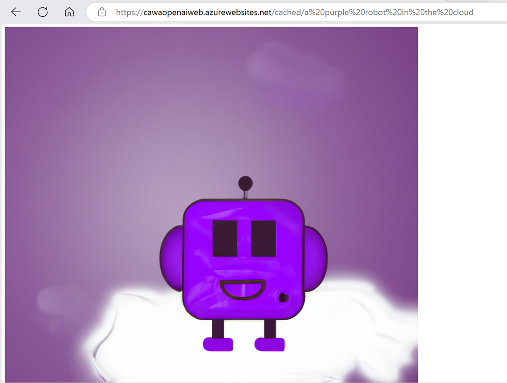

# .NET 8 Web Application with Redis Output Caching and Azure Open AI

## Overview
This repository contains sample code for an AI image generation web application. It calls into Azure Open AI DallE to generate images based on user prompt. It allows responses from the /cached/ endpoint to be saved in Azure Cache for Redis through the [IOutputCache() abstraction](https://learn.microsoft.com/aspnet/core/performance/caching/output?preserve-view=true&view=aspnetcore-8.0#cache-storage). To experiment with the demo:
1. call the /cached/ endpoint with your command prompt. Refresh the browser. Observe that the output picture does not change and refresh finishes instantly. 
2. call the /nocache/ endpoint with your command prompt. Refresh the browser. Observe that refresh takes a noticeable delay and a new picture will be generated.

Here is an example output:


## Test the application locally

Prerequisites:
- Azure subscription. [Start free](https://azure.microsoft.com/free)
- .NET 8 or above. [Download](https://dotnet.microsoft.com/download/dotnet/8.0)
- Docker. [Get docker](https://docs.docker.com/get-docker/)
- (optional) Visual Studio. [Download](https://visualstudio.microsoft.com/)

1. Clone this repository
2. Open in Visual Studio
3. Open command prompt. Change directory to /OutputCacheDallESample/. folder where .csproj file is located
4. Initialize user-secret if not yet.
    ```
    dotnet user-secrets init
    ```
5. Create the following resources in Azure:
- Azure Cache for Redis
- Azure Open AI

6. In the command prompt, initialize the following:
    ```
    dotnet user-secrets set "RedisCacheConnection" "your_rediscache_connectionstring"

    dotnet user-secrets set "apiUrl" "https://<your_openai_name>.openai.azure.com/openai/images/generations:submit?api-version=2023-06-01-preview"

    dotnet user-secrets set "apiKey" "your_openai_api_key"
    ```

7. Start debugging in Visual Studio
8. In the browser launched, append /nocache/{your_description_for_a_picture} and /cached/{your_description_for_a_picture} to observe the differences. With Output Caching, pictured generated from /cached/ endpoint will consistently be the same and return faster than from the /nocache/ endpoint.

## Run the application in Azure

Prerequisites:
- Azure subscription. [Start free](https://azure.microsoft.com/free)
- .NET 8 or above. [Download](https://dotnet.microsoft.com/download/dotnet/8.0)
- Docker. [Get docker](https://docs.docker.com/get-docker/)
- Azure Developer CLI. [Install](https://learn.microsoft.com/azure/developer/azure-developer-cli/install-azd?tabs=winget-windows%2Cbrew-mac%2Cscript-linux&pivots=os-windows)

1. Open a command prompt
2. Change directory to the project folder where azure.yaml file is located
3. Run:
    ```
    azd up
    ```
4. Follow command prompt to enter environment name and select subscription
5. This will create all the resources needed to run the sample:
- Azure Container App instance and environment
- Azure Container Registry
- Azure Open AI service
- Azure Cache for Redis
- Azure Key Vault

6. To clean up the environment, run 
    ```
    azd down
    ```